# Modern Admin Theme — Developer & Designer Guide

An in-depth technical reference for designers and developers who want to understand, customize, or extend the Modern admin theme.

## Table of Contents

- [Architecture Overview](#architecture-overview)
- [File Structure](#file-structure)
- [Request Lifecycle](#request-lifecycle)
- [Template System](#template-system)
- [CSS Architecture](#css-architecture)
- [JavaScript Architecture](#javascript-architecture)
- [The Widget System](#the-widget-system)
- [Data Flow Reference](#data-flow-reference)
- [Customization Recipes](#customization-recipes)
- [Creating a New Color Preset](#creating-a-new-color-preset)
- [Adding a Dashboard Section](#adding-a-dashboard-section)
- [Adding a Sidebar Section](#adding-a-sidebar-section)
- [Replacing Emoji Icons with SVG](#replacing-emoji-icons-with-svg)
- [Adding a New Chart](#adding-a-new-chart)
- [Modifying the Header](#modifying-the-header)
- [Adding a New Template Partial](#adding-a-new-template-partial)
- [Creating Module Widgets](#creating-module-widgets)
- [Internationalization](#internationalization)
- [Performance Considerations](#performance-considerations)
- [Testing](#testing)
- [Compatibility Notes](#compatibility-notes)

---

## Architecture Overview

The Modern theme is a XOOPS admin GUI theme that extends `XoopsSystemGui`. It consists of:

```mermaid
block-beta
    columns 1
    block:php["PHP Layer — modern.php"]
        columns 3
        p1["Extends XoopsSystemGui"]
        p2["Queries DB for stats, charts, widgets"]
        p3["Assigns all Smarty template variables"]
    end
    block:tpl["Template Layer — theme.tpl + xotpl/*.tpl"]
        columns 3
        t1["Smarty 3 with <{ }> delimiters"]
        t2["Modular partials (head, sidebar, dashboard)"]
        t3["Data bridge: PHP → JSON → JavaScript"]
    end
    block:css["CSS Layer — css/*.css"]
        columns 3
        c1["Design tokens via CSS custom properties"]
        c2["Light mode defaults, dark mode overrides"]
        c3["fixes.css for XOOPS core !important rules"]
    end
    block:js["JavaScript Layer — js/*.js"]
        columns 3
        j1["jQuery-based, no build step"]
        j2["theme.js / charts.js"]
        j3["customizer.js + cookies"]
    end
    block:wid["Widget Layer — class/ + widgets/"]
        columns 3
        w1["ModernThemeWidgetInterface contract"]
        w2["WidgetLoader: auto-discovery + sort"]
        w3["11 pre-built module widgets"]
    end

    php --> tpl --> css --> js --> wid
```

Key design principles:
- **No build tooling** — Plain CSS, plain JS, no Sass/Webpack/npm required
- **CSS custom properties** — All colors, spacing, and shadows use `var()` tokens
- **Progressive enhancement** — Works without JavaScript (charts and customizer degrade gracefully)
- **Cookie-based persistence** — No database tables, no module configs, no server-side storage
- **Auto-discovery** — Widgets load automatically from module directories

---

## File Structure

```text
modern/
├── modern.php                    # Theme class (XoopsGuiModern extends XoopsSystemGui)
├── theme.tpl                     # Root HTML document template
├── menu.php                      # System admin menu builder
│
├── class/
│   ├── ModuleWidgetInterface.php # Widget contract (3 methods)
│   └── WidgetLoader.php          # Widget auto-discovery engine
│
├── css/
│   ├── modern.css                # Design tokens + full light-mode styles (~1200 lines)
│   ├── dark.css                  # Dark mode variable overrides (~200 lines)
│   └── fixes.css                 # !important overrides for XOOPS core CSS (~300 lines)
│
├── js/
│   ├── theme.js                  # Core: sidebar toggle, dark mode, help, messages
│   ├── charts.js                 # Chart.js initialization, dark mode sync, content filter
│   ├── customizer.js             # Settings panel, color presets, cookie management
│   └── dashboard.js              # Table hover, refresh button
│
├── xotpl/                        # Smarty template partials
│   ├── xo_metas.tpl             # <head> meta tags + $xoops_module_header
│   ├── xo_scripts.tpl           # Placeholder for inline scripts
│   ├── xo_head.tpl              # Header bar (brand, services, dark mode toggle)
│   ├── xo_sidebar.tpl           # Left sidebar navigation
│   ├── xo_toolbar.tpl           # Placeholder for breadcrumb/toolbar
│   ├── xo_dashboard.tpl         # Dashboard: KPIs, charts, widgets, system info
│   ├── xo_widgets.tpl           # Widget card renderer (iterates $module_widgets)
│   ├── xo_page.tpl              # Module content area + admin links bar
│   ├── xo_customizer.tpl        # Slide-in settings panel + FAB button
│   └── xo_footer.tpl            # Footer bar
│
├── language/english/
│   ├── main.php                  # ~63 language constants (_MODERN_* prefix)
│   └── index.php                 # Security guard
│
├── widgets/                      # Pre-built widget files (copy to module dirs)
│   ├── alumni/class/ModernThemeWidget.php
│   ├── jobs/class/ModernThemeWidget.php
│   ├── newbb/class/ModernThemeWidget.php
│   ├── news/class/ModernThemeWidget.php
│   ├── pedigree/class/ModernThemeWidget.php
│   ├── protector/class/ModernThemeWidget.php
│   ├── publisher/class/ModernThemeWidget.php
│   ├── realestate/class/ModernThemeWidget.php
│   ├── tdmdownloads/class/ModernThemeWidget.php
│   ├── vision2026/class/ModernThemeWidget.php
│   └── xblog/class/ModernThemeWidget.php
│
├── icons/                        # System service icons (PNG)
├── images/                       # Theme images
├── docs/                         # Documentation
└── tests/                        # Compatibility tests
```

---

## Request Lifecycle

When an admin page loads, execution flows through:

```mermaid
flowchart TD
    A["1. XOOPS Bootstrap<br/><code>include/common.php</code>"] --> B["2. <code>admin.php</code> dispatches<br/>to active admin GUI"]
    B --> C["3. XoopsSystemGui loads<br/><code>modern.php</code>"]
    C --> D["4. <code>xoops_loadLanguage()</code><br/>Defines all _MODERN_* constants"]
    D --> E["5. <code>XoopsGuiModern::header()</code>"]

    E --> E1["parent::header()"]
    E --> E2["Asset injection<br/>Chart.js, jQuery, CSS/JS"]
    E --> E3["getSystemInfo()"]
    E --> E4["getEnhancedStats()"]
    E --> E5["getUserStats()"]
    E --> E6["getModuleStats()"]
    E --> E7["getContentStats()"]
    E --> E8["loadModuleWidgets()"]
    E --> E9["ComposerInfo::getComposerInfo()"]
    E --> E10["buildMenu()"]

    E10 --> F["6. Smarty renders <code>theme.tpl</code>"]

    F --> F1["xo_metas.tpl<br/>‹head› + CSS/JS"]
    F --> F2["xo_head.tpl<br/>Header bar"]
    F --> F3["xo_sidebar.tpl<br/>Navigation"]
    F --> F4["xo_dashboard.tpl<br/>KPIs, charts, widgets"]
    F4 -.-> F4a["Emits<br/><code>window.XOOPS_DASHBOARD_DATA</code>"]
    F --> F5["xo_page.tpl<br/>Module content"]
    F --> F6["xo_footer.tpl"]
    F --> F7["xo_customizer.tpl<br/>Settings panel"]

    F7 --> G["7. JavaScript executes"]

    G --> G1["theme.js<br/>Dark mode, sidebar, messages"]
    G --> G2["dashboard.js<br/>Table interactions"]
    G --> G3["charts.js<br/>Builds Chart.js instances"]
    G --> G4["customizer.js<br/>Restores cookie preferences"]
```

### Component Interaction

The same lifecycle viewed as inter-component communication:

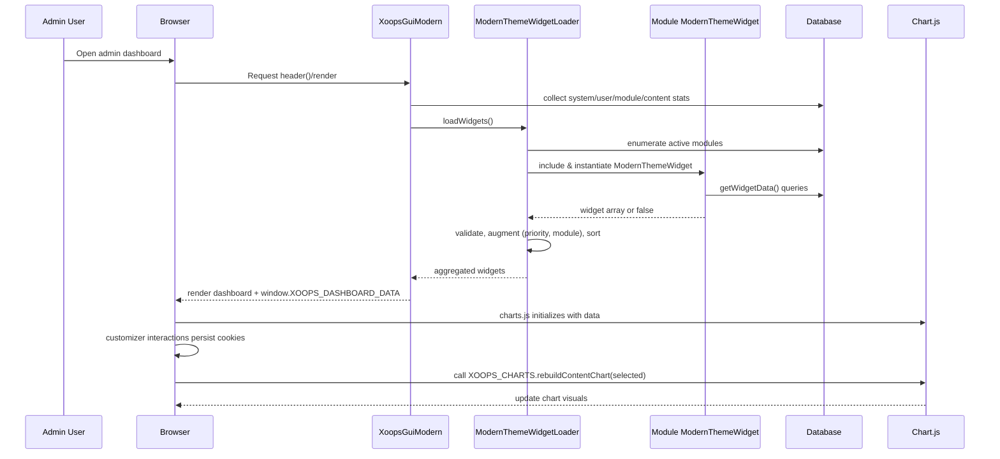

---

## Template System

### Smarty Delimiters

XOOPS uses custom Smarty delimiters. **Never** use standard `{` `}` delimiters:

```smarty
<{$variable}>                              ← Variable output
<{$variable|escape:'html'}>                ← Escaped output (XSS prevention)
<{foreach from=$items item=row}>           ← Control structure
<{if $condition}>...<{/if}>                ← Conditional
<{include file="$theme_tpl/xo_head.tpl"}> ← Partial include
<{$smarty.const._MODERN_LABEL}>            ← Language constant
```

### Template Hierarchy

`theme.tpl` is the root document. It includes all partials via the `$theme_tpl` variable:

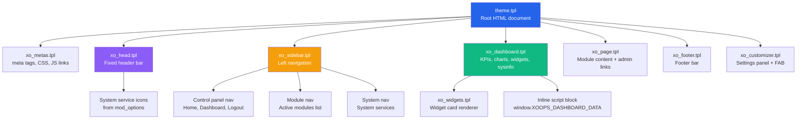

All partials are included via `<{include file="$theme_tpl/xo_*.tpl"}>`. The `$theme_tpl` variable resolves to the `xotpl/` directory path, making it easy to override individual templates.

### Key Smarty Variables

These variables are assigned by `modern.php` and available in all templates:

| Variable | Type | Source |
|----------|------|--------|
| `$xoops_sitename` | string | Site configuration |
| `$xoops_dirname` | string | Current module dirname |
| `$dark_mode` | string | Cookie value ('0' or '1') |
| `$theme_url` | string | URL to theme directory |
| `$enhanced_stats` | array | User statistics |
| `$user_chart_data` | JSON string | Registration chart data |
| `$group_stats` | JSON string | Group distribution data |
| `$content_stats` | JSON string | Content per module |
| `$module_widgets` | array | Widget data keyed by dirname |
| `$control_menu` | array | Control panel nav items |
| `$module_menu` | array | Module nav items |
| `$mod_options` | array | Current module admin icons |
| `$system_services` | array | System admin service icons |
| `$modules` | array | Module list for dashboard grid |
| `$composerPackages` | array | Installed Composer packages |

### Adding a Template Partial

1. Create `xotpl/xo_mypartial.tpl`
1. Include it in `theme.tpl`:

```smarty
<{include file="$theme_tpl/xo_mypartial.tpl"}>
```

1. Assign any needed variables in `modern.php`:

```php
$tpl->assign('my_data', $data);
```

---

## CSS Architecture

### Design Token System

All visual properties flow from CSS custom properties defined in `:root`. This means changing one variable propagates everywhere:

```css
:root {
    /* Layout */
    --sidebar-width: 260px;
    --header-height: 64px;

    /* Border Radius */
    --radius-sm: 4px;     /* Badges, small elements */
    --radius: 8px;        /* Cards, inputs, buttons */
    --radius-lg: 12px;    /* Large containers, panels */

    /* Shadows */
    --shadow-sm: 0 1px 2px 0 rgb(0 0 0 / 0.05);
    --shadow: 0 1px 3px 0 rgb(0 0 0 / 0.1);
    --shadow-md: 0 4px 6px -1px rgb(0 0 0 / 0.1);
    --shadow-lg: 0 10px 15px -3px rgb(0 0 0 / 0.1);

    /* Brand Colors */
    --primary: #2563eb;       /* Main accent (Blue 600) */
    --primary-dark: #1e40af;  /* Hover/active (Blue 800) */
    --primary-light: #3b82f6; /* Light accent (Blue 500) */
    --secondary: #64748b;     /* Secondary UI (Slate 500) */
    --success: #10b981;       /* Success states (Emerald 500) */
    --warning: #f59e0b;       /* Warnings (Amber 500) */
    --danger: #ef4444;        /* Errors (Red 500) */
    --info: #06b6d4;          /* Info (Cyan 500) */

    /* Backgrounds */
    --bg-primary: #f8fafc;    /* Page background (Slate 50) */
    --bg-secondary: #ffffff;  /* Cards, sidebar, header */
    --bg-tertiary: #f1f5f9;   /* Hover states, alt rows (Slate 100) */

    /* Text */
    --text-primary: #0f172a;  /* Main text (Slate 900) */
    --text-secondary: #475569;/* Subdued text (Slate 600) */
    --text-tertiary: #94a3b8; /* Placeholders (Slate 400) */

    /* Borders */
    --border: #e2e8f0;        /* Standard borders (Slate 200) */
    --border-light: #f1f5f9;  /* Subtle separators (Slate 100) */
}
```

### Three-File Strategy

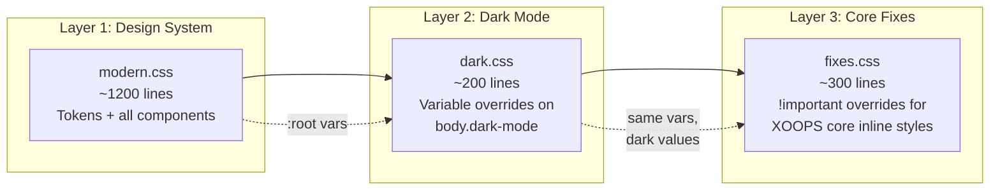

| File | Purpose | Uses `!important`? |
|------|---------|-------------------|
| `modern.css` | Design tokens, layout, all components | No |
| `dark.css` | Dark mode variable overrides on `body.dark-mode` | No |
| `fixes.css` | Overrides for XOOPS core inline styles | Yes (required) |

**Why `fixes.css` exists:** XOOPS core and some modules inject inline styles and CSS rules that can't be overridden through normal cascade. `fixes.css` uses `!important` surgically on specific selectors to fix these conflicts. It's organized into numbered sections with comments explaining each override.

### Dark Mode

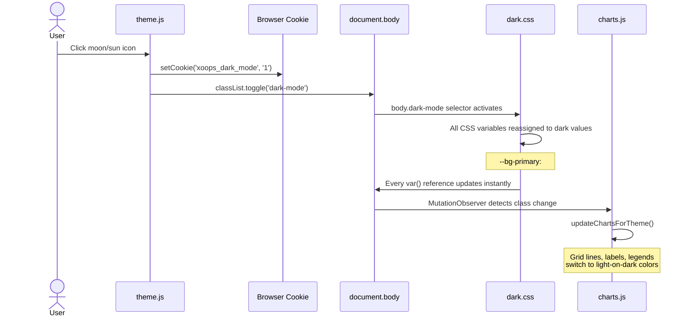

Dark mode is implemented by reassigning all CSS custom properties on the `body.dark-mode` selector in `dark.css`:

```css
body.dark-mode {
    --bg-primary: #0f172a;     /* Deep navy */
    --bg-secondary: #1e293b;   /* Card backgrounds */
    --bg-tertiary: #334155;    /* Hover states */
    --text-primary: #f1f5f9;   /* Light text */
    --text-secondary: #cbd5e1;
    --text-tertiary: #94a3b8;
    --border: #334155;
    --border-light: #475569;
    /* ... shadows, brand colors adjusted for dark */
}
```

Because all components use `var()` tokens, dark mode works automatically without per-component overrides.

### Responsive Breakpoints

| Breakpoint | Behavior |
|------------|----------|
| `> 1024px` | Full desktop layout. Sidebar visible, collapsible to 80px icon-only mode. |
| `≤ 1024px` | Sidebar hidden by default, slides in as overlay via `body.sidebar-open`. Footer and main content span full width. |
| `≤ 768px` | KPIs and charts collapse to single column. Header text shrinks. Customizer panel goes full-width. |

### Sidebar State Machine

```mermaid
stateDiagram-v2
    state "Desktop (> 1024px)" as Desktop {
        [*] --> Expanded
        Expanded --> Collapsed: Click hamburger icon
        Collapsed --> Expanded: Click hamburger icon
        state Expanded {
            note right of Expanded: 260px wide\nIcons + labels\nmargin-left: 260px
        }
        state Collapsed {
            note right of Collapsed: 80px wide\nIcons only (tooltips)\nmargin-left: 80px
        }
    }

    state "Tablet/Mobile (≤ 1024px)" as Mobile {
        [*] --> Hidden
        Hidden --> Overlay: Click hamburger icon
        Overlay --> Hidden: Click outside / hamburger
        state Hidden {
            note right of Hidden: Sidebar off-screen\nmargin-left: 0
        }
        state Overlay {
            note right of Overlay: Sidebar slides in\nDim backdrop behind\nbody.sidebar-open
        }
    }
```

### Page Layout Structure

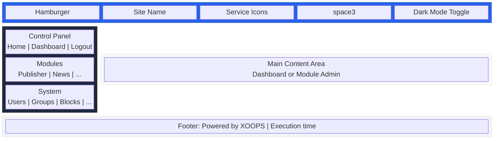

### Key Layout Selectors

```css
.modern-header   { position: fixed; height: var(--header-height); z-index: 1000; }
.modern-sidebar  { width: var(--sidebar-width); position: fixed; z-index: 999; }
.modern-main     { margin-left: var(--sidebar-width); padding-top: var(--header-height); }
.modern-footer   { margin-left: var(--sidebar-width); }
```

When the sidebar collapses (`body.sidebar-open` on desktop), `--sidebar-width` effectively becomes `80px` through explicit rules that override `margin-left`.

---

## JavaScript Architecture

All JavaScript is ES2015+ (uses `const`, `let`, arrow functions) with jQuery. No build step or transpilation — scripts are loaded directly by the browser. Each file is a self-contained IIFE or plain script.

### Load Order

Scripts are injected by `modern.php` via `$xoTheme->addScript()`:

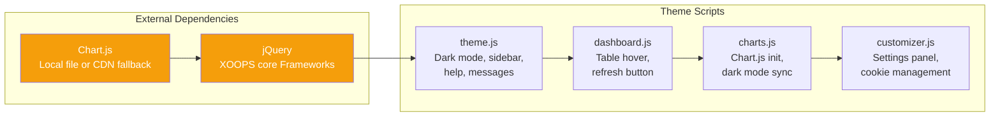

1. `Chart.js` (local via `browse.php` or CDN fallback)
1. `jQuery` (from XOOPS core Frameworks)
1. `theme.js` — Core UI behaviors
1. `dashboard.js` — Table interactions
1. `charts.js` — Chart initialization
1. `customizer.js` — Settings panel

### theme.js — Core Behaviors

```text
initDarkMode()       → Reads/writes xoops_dark_mode cookie, toggles body.dark-mode
initSidebarToggle()  → Toggles body.sidebar-open on hamburger click
initHelpToggle()     → Shows/hides .tips and .xo-help-content, persists in cookie
initMessages()       → Moves .errorMsg/.warningMsg to top of .modern-main,
                        auto-dismisses after 5 seconds
setCookie(name, val, days) → SameSite=Lax, conditional Secure flag
getCookie(name)            → Standard cookie reader
```

### charts.js — Chart.js Integration

```text
initCharts()                → Entry point, waits for Chart.js to load (500ms retry)
initUserRegistrationChart() → Line chart from window.XOOPS_DASHBOARD_DATA.userChart
initUserGroupChart()        → Doughnut chart from .groupStats
initContentChart()          → Bar chart from .contentStats (filtered by cookie)
rebuildContentChart(sel)    → Live rebuild when customizer changes module selection
updateChartsForTheme()      → Updates all chart colors for dark/light mode
```

**PHP → JS data bridge:** `xo_dashboard.tpl` emits a `<script>` block that sets `window.XOOPS_DASHBOARD_DATA` with JSON-encoded chart data. This avoids AJAX calls and keeps the dashboard in a single request.

**Dark mode sync:** A `MutationObserver` watches `document.body` for class changes. When `dark-mode` is added or removed, `updateChartsForTheme()` fires automatically.

### customizer.js — Settings Panel

```text
applyColorScheme(theme)  → Sets --primary, --primary-dark, --primary-light on :root
setCookie(name, val, days) → Own cookie helper (SameSite=Lax + Secure)
```

**Color presets** are defined as a JavaScript object:

```javascript
var colorSchemes = {
    default: { primary: '#2563eb', primaryDark: '#1e40af', primaryLight: '#3b82f6' },
    green:   { primary: '#10b981', primaryDark: '#059669', primaryLight: '#34d399' },
    purple:  { primary: '#8b5cf6', primaryDark: '#7c3aed', primaryLight: '#a78bfa' },
    orange:  { primary: '#f59e0b', primaryDark: '#d97706', primaryLight: '#fbbf24' },
    teal:    { primary: '#14b8a6', primaryDark: '#0d9488', primaryLight: '#2dd4bf' },
    red:     { primary: '#ef4444', primaryDark: '#dc2626', primaryLight: '#f87171' }
};
```

**Body classes toggled by customizer:**

| Class | Effect |
|-------|--------|
| `compact-sidebar` | Sidebar → 80px, hides nav text |
| `no-animations` | Disables all transitions and animations |
| `compact-view` | Reduces padding on cards, tables, nav |

### Cookie Reference

| Cookie Name | Default | Type | Persists |
|-------------|---------|------|----------|
| `xoops_dark_mode` | `'0'` | `'0'`/`'1'` | 365 days |
| `xoops_color_scheme` | `'default'` | Preset name | 365 days |
| `xoops_show_kpis` | `'1'` | `'0'`/`'1'` | 365 days |
| `xoops_show_charts` | `'1'` | `'0'`/`'1'` | 365 days |
| `xoops_show_widgets` | `'1'` | `'0'`/`'1'` | 365 days |
| `xoops_show_system_info` | `'1'` | `'0'`/`'1'` | 365 days |
| `xoops_compact_sidebar` | `'0'` | `'0'`/`'1'` | 365 days |
| `xoops_sidebar_icons` | `'1'` | `'0'`/`'1'` | 365 days |
| `xoops_animations` | `'1'` | `'0'`/`'1'` | 365 days |
| `xoops_compact_view` | `'0'` | `'0'`/`'1'` | 365 days |
| `xoops_content_modules` | all | JSON array | 365 days |
| `xoops_help_visible` | `'0'` | `'0'`/`'1'` | 30 days |

---

## The Widget System

### Interface

Every widget must implement `ModernThemeWidgetInterface`:

```php
interface ModernThemeWidgetInterface
{
    public function getWidgetData();      // Returns array or false
    public function getWidgetPriority();  // Returns int 0-100
    public function isWidgetEnabled();    // Returns bool
}
```

### Discovery Process

`ModernThemeWidgetLoader::loadWidgets()` performs these steps:

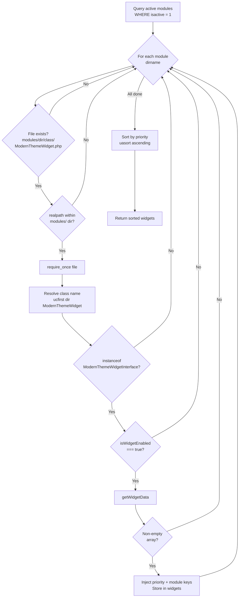

### Widget Data Structure

```php
[
    'title'        => 'Module Name',         // Required: widget heading
    'icon'         => '📦',                  // Required: emoji icon
    'stats'        => [                      // Optional: stat counters
        'key_name' => int,                   // Key → label via |replace:'_':' '|capitalize
    ],
    'recent'       => [                      // Optional: recent items list (max 5)
        [
            'title'        => string,        // Required, should be htmlspecialchars'd
            'date'         => int,           // Optional: Unix timestamp
            'author'       => string,        // Optional: "by {author}"
            'status'       => string,        // Optional: badge text
            'status_class' => string,        // Optional: 'success' | 'warning'
        ],
    ],
    'admin_url'    => string,                // Optional: "View All →" link
    // These are injected by WidgetLoader:
    'priority'     => int,                   // From getWidgetPriority()
    'module'       => string,                // Module dirname
]
```

### Widget Template Rendering

`xo_widgets.tpl` iterates `$module_widgets` and renders each widget card:

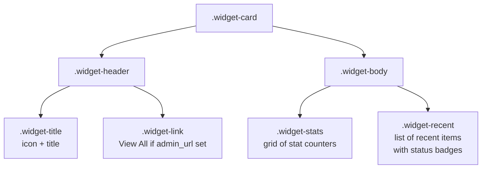

### Pre-Built Widgets

The `widgets/` directory contains ready-to-deploy widget files. These are **staging copies** — to activate them, copy each file to the corresponding module's `class/` directory:

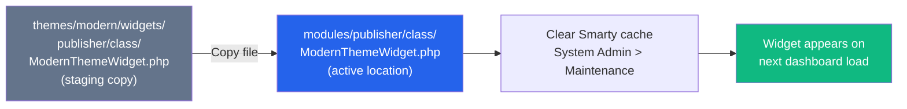

| Widget | Priority | Stats | Recent Items |
|--------|----------|-------|--------------|
| Publisher | 30 | published, submitted, categories | 5 articles with status |
| News | 40 | published, pending | 5 stories |
| Jobs | 45 | active_jobs, applications, companies | 5 job postings |
| NewBB | 50 | topics, posts | 5 forum posts |
| Protector | 35 | blocked_ips, bad_behaviors | 5 security events |
| TDMDownloads | 50 | downloads, categories | 5 files |
| Alumni | 55 | profiles, schools | 5 graduates |
| Pedigree | 60 | animals, breeds | 5 animal entries |
| RealEstate | 50 | properties, agents | 5 listings |
| Vision2026 | 50 | articles, categories | 5 articles |
| XBlog | 45 | posts, categories | 5 blog entries |

For the complete widget development guide, see [MODULE_INTEGRATION_GUIDE.md](MODULE_INTEGRATION_GUIDE.md).

---

## Data Flow Reference

### PHP → Smarty → JavaScript

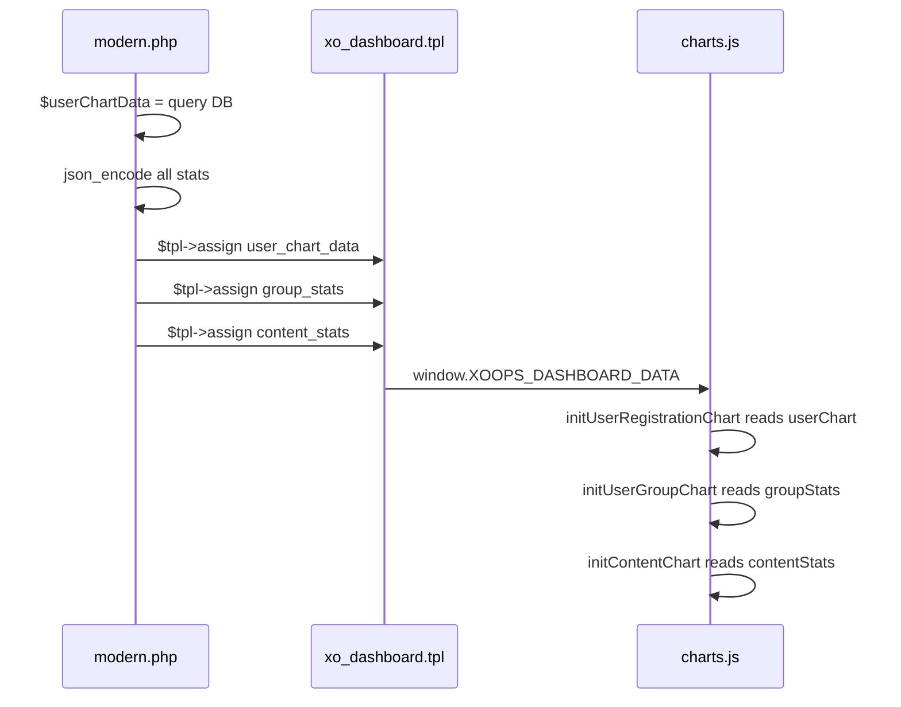

### Customizer → Charts (live rebuild)

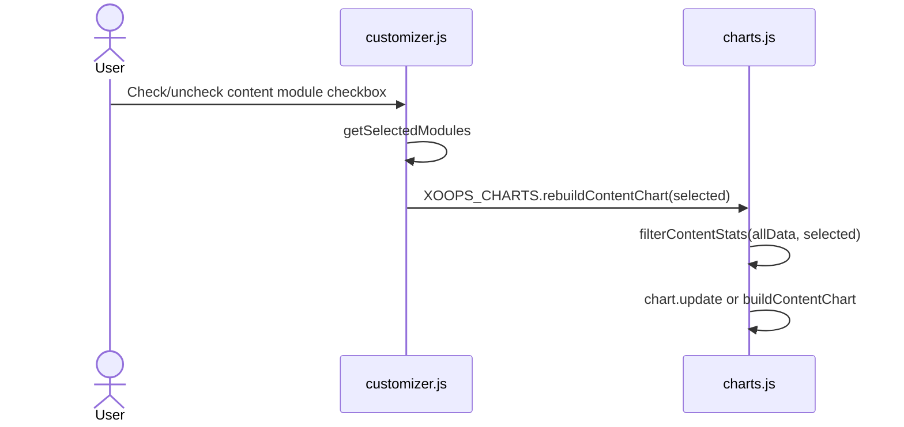

### Customizer → CSS (instant theme change)

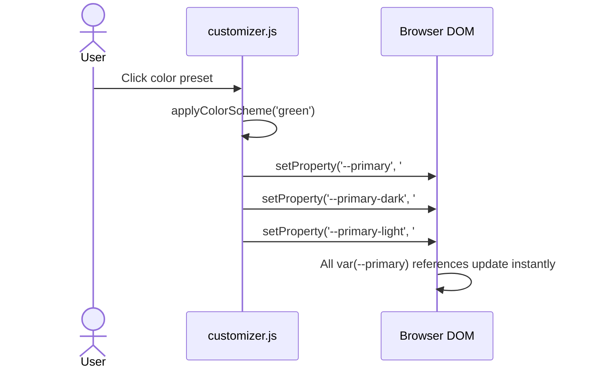

---

## Customization Recipes

### Creating a New Color Preset

**Step 1:** Add the color definition to `customizer.js`:

```javascript
var colorSchemes = {
    // ... existing presets ...
    indigo: {
        primary: '#6366f1',
        primaryDark: '#4f46e5',
        primaryLight: '#818cf8'
    }
};
```

**Step 2:** Add the preset button to `xo_customizer.tpl`:

```smarty
<button class="color-preset" data-theme="indigo" title="Indigo">
    <span class="color-swatch" style="background: linear-gradient(135deg, #6366f1, #4f46e5);"></span>
    <span class="color-label"><{$smarty.const._MODERN_COLOR_INDIGO}></span>
</button>
```

**Step 3:** Add the language constant to `language/english/main.php`:

```php
define('_MODERN_COLOR_INDIGO', 'Indigo');
```

The customizer JS already handles any `data-theme` value that matches a key in `colorSchemes`.

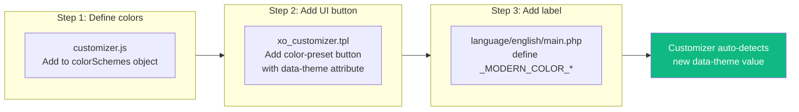

### Adding a Dashboard Section

**Step 1:** Add a data method to `modern.php`:

```php
private function getSecurityStats(&$tpl)
{
    global $xoopsDB;
    // Your queries here...
    $tpl->assign('security_stats', $stats);
}
```

Call it from `header()`:

```php
$this->getSecurityStats($tpl);
```

**Step 2:** Create a template section in `xo_dashboard.tpl` (or a new partial):

```smarty
<{if $security_stats}>
<div class="security-section">
    <div class="chart-card">
        <div class="chart-header">
            <div class="chart-title"><{$smarty.const._MODERN_SECURITY_OVERVIEW}></div>
        </div>
        <div class="chart-body">
            <!-- Your content here -->
        </div>
    </div>
</div>
<{/if}>
```

**Step 3:** Add a customizer toggle (optional). In `xo_customizer.tpl`:

```smarty
<label class="customizer-toggle">
    <input type="checkbox" id="toggleSecurity" checked>
    <span class="toggle-switch"></span>
    <span class="toggle-label"><{$smarty.const._MODERN_SECURITY_SECTION}></span>
</label>
```

And handle it in `customizer.js` by adding cookie read/write logic following the existing toggle pattern.

### Adding a Sidebar Section

Edit `xo_sidebar.tpl` and add a new `<details>` block:

```smarty
<{if $my_nav_items}>
<details open>
    <summary class="nav-section">
        <span class="nav-section-title"><{$smarty.const._MODERN_MY_SECTION}></span>
        <span class="nav-section-arrow">▸</span>
    </summary>
    <ul class="nav-list">
        <{foreach item=item from=$my_nav_items}>
        <li class="nav-item">
            <a href="<{$item.link}>">
                <span class="nav-icon">📌</span>
                <span class="nav-text"><{$item.title|escape:'html'}></span>
            </a>
        </li>
        <{/foreach}>
    </ul>
</details>
<{/if}>
```

Assign the data in `modern.php`:

```php
$tpl->assign('my_nav_items', $items);
```

### Replacing Emoji Icons with SVG

The theme uses emoji for icons throughout (sidebar, widgets, header). To switch to SVG icons:

**1. Sidebar icons** — In `xo_sidebar.tpl`, replace:

```smarty
<span class="nav-icon">🏠</span>
```

With:

```smarty
/icons/home.svg" class="nav-icon-img" alt="">
```

**2. Widget icons** — In `xo_widgets.tpl`, the icon is rendered as text. Change:

```smarty
<{if $widget.icon}><{$widget.icon|escape:'html'}> <{/if}>
```

To:

```smarty
<{if $widget.icon}>" class="widget-icon-img" alt=""> <{/if}>
```

Then update widget PHP files to return image paths instead of emoji strings.

**3. CSS** — Add styles for the SVG icon class:

```css
.nav-icon-img, .widget-icon-img {
    width: 20px;
    height: 20px;
    vertical-align: middle;
    opacity: 0.8;
}
```

### Adding a New Chart

**Step 1:** Add a `<canvas>` element in `xo_dashboard.tpl`:

```smarty
<div class="chart-card">
    <div class="chart-header">
        <div class="chart-title">My Chart</div>
    </div>
    <canvas id="myChart"></canvas>
</div>
```

**Step 2:** Prepare data in `modern.php`:

```php
$tpl->assign('my_chart_data', json_encode($chartData));
```

**Step 3:** Add the JSON to the data bridge in `xo_dashboard.tpl`:

```smarty
window.XOOPS_DASHBOARD_DATA = {
    userChart: <{$user_chart_data}>,
    groupStats: <{$group_stats}>,
    <{if $content_stats}>contentStats: <{$content_stats}>,<{/if}>
    myChart: <{$my_chart_data}>
};
```

**Step 4:** Initialize the chart in `charts.js`:

```javascript
function initMyChart() {
    var canvas = document.getElementById('myChart');
    if (!canvas || !window.XOOPS_DASHBOARD_DATA.myChart) return;

    var data = window.XOOPS_DASHBOARD_DATA.myChart;

    charts.myChart = new Chart(canvas, {
        type: 'bar',  // or 'line', 'doughnut', 'pie', etc.
        data: {
            labels: data.map(function(item) { return item.label; }),
            datasets: [{
                data: data.map(function(item) { return item.value; }),
                backgroundColor: '#2563eb'
            }]
        },
        options: Object.assign({}, defaultChartConfig, {
            // chart-specific options
        })
    });
}
```

Add `initMyChart()` to the `initCharts()` function. The chart will automatically get dark mode support through `updateChartsForTheme()` since it iterates all entries in the `charts` object.

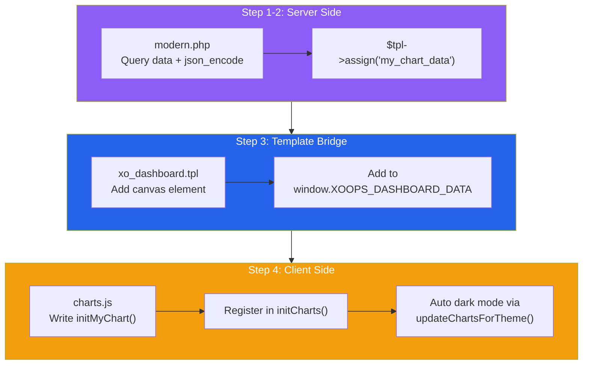

### Modifying the Header

The header template is `xo_head.tpl`. Common modifications:

**Add a notification bell:**

```smarty
<div class="header-actions">
    <button id="notificationBell" class="btn-icon" title="Notifications">
        <span>🔔</span>
        <{if $unread_count > 0}>
            <span class="notification-badge"><{$unread_count}></span>
        <{/if}>
    </button>
    <!-- existing dark mode toggle -->
</div>
```

**Add a user avatar:**

```smarty
<div class="header-actions">
    <div class="header-user">
        " class="header-avatar" alt="">
        <span class="header-username"><{$xoops_uname|escape:'html'}></span>
    </div>
    <!-- existing buttons -->
</div>
```

**Add a search bar:**

```smarty
<div class="header-search">
    <input type="text" id="adminSearch" placeholder="Search admin..." class="header-search-input">
</div>
```

### Adding a New Template Partial

1. Create `xotpl/xo_mypartial.tpl` with your Smarty markup
1. Include it in `theme.tpl` at the desired position:

```smarty
<{include file="$theme_tpl/xo_mypartial.tpl"}>
```

1. Assign any required variables in `modern.php`
1. Clear Smarty cache after adding

---

## Creating Module Widgets

For the complete widget creation guide with examples, code templates, and best practices, see [MODULE_INTEGRATION_GUIDE.md](MODULE_INTEGRATION_GUIDE.md).

Quick summary:

1. Create `modules/{yourmodule}/class/ModernThemeWidget.php`
2. Class name: `{Ucfirst_dirname}ModernThemeWidget`
3. Implement `ModernThemeWidgetInterface` (3 methods)
4. Return stats + recent items from `getWidgetData()`
5. Always guard DB queries with `if ($result)` null checks
6. Use `htmlspecialchars()` on all user-sourced strings

---

## Internationalization

All user-visible strings use language constants with the `_MODERN_` prefix, defined in `language/english/main.php`.

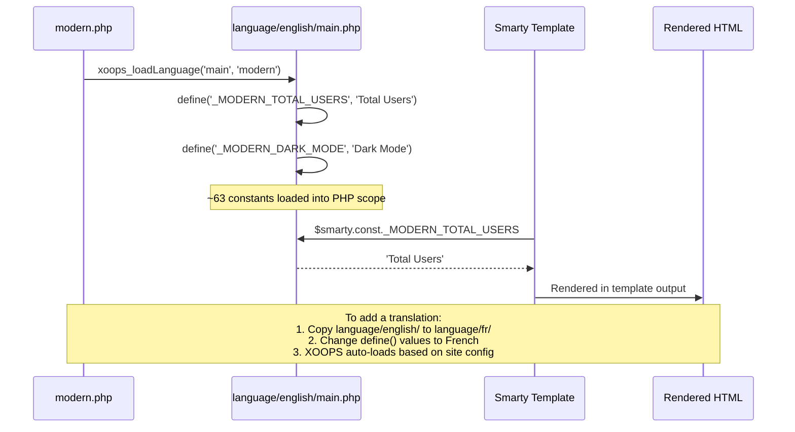

### Adding a Translation

1. Copy `language/english/` to `language/{yourlanguage}/`
2. Translate all `define()` values in `main.php`
3. XOOPS loads the correct language file based on site configuration

### Constant Naming Convention

```php
define('_MODERN_TOTAL_USERS', 'Total Users');           // Dashboard KPIs
define('_MODERN_USER_REGISTRATIONS', 'User Registrations'); // Chart titles
define('_MODERN_STATUS_ACTIVE', 'Active');               // Status badges
define('_MODERN_COLOR_DEFAULT', 'Default');               // Customizer labels
define('_MODERN_MOD_ARTICLES', 'Articles');               // Content module labels
define('_MODERN_POWERED_BY', 'Powered by XOOPS');        // Footer
```

### Adding a New Constant

1. Add the `define()` to `language/english/main.php`
2. Use it in templates as `<{$smarty.const._MODERN_MY_CONSTANT}>`
3. Or in PHP as `_MODERN_MY_CONSTANT`

**Critical rule:** Never reference a constant without defining it first. One undefined constant causes a blank screen.

---

## Performance Considerations

### Database Queries

The dashboard executes these queries on every page load:

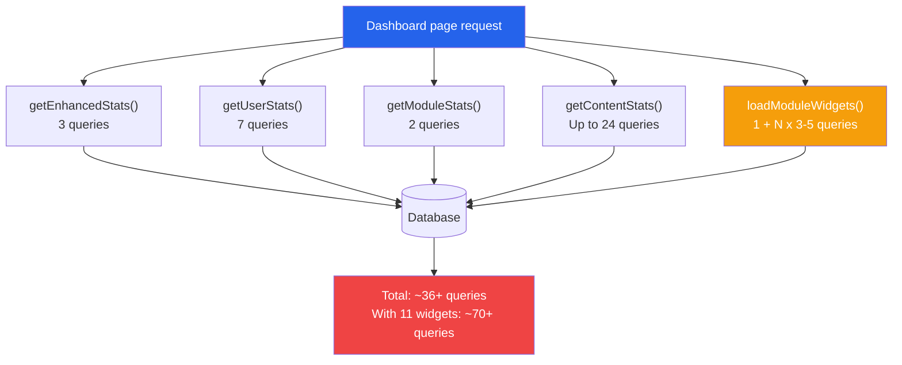

| Source | Queries | Notes |
|--------|---------|-------|
| `getEnhancedStats()` | 3 COUNT queries | Users table |
| `getUserStats()` | 6 COUNT queries + 1 JOIN | 6-month loop + groups |
| `getModuleStats()` | 2 COUNT queries | Modules table |
| `getContentStats()` | Up to 24 queries | SHOW TABLES + COUNT per known module |
| `loadModuleWidgets()` | 1 module query + N widget queries | N = active modules with widgets |

**Total:** ~36+ queries for a full dashboard with all modules.

### Optimization Strategies

1. **Widget queries are the main variable.** Each widget adds 3-5 queries. If you have 11 widgets active, that's 33-55 extra queries. Only deploy widgets for modules you actively use.

2. **Content stats check table existence.** The `SHOW TABLES LIKE` queries are cheap but add up. Remove modules from the `$knownModules` array in `getContentStats()` if you know they'll never be installed.

3. **No caching layer.** Dashboard data is always fresh but always queried. For high-traffic sites, consider adding `XoopsCache::read()`/`write()` with a short TTL (5 minutes) around the stat queries.

4. **Chart.js loads once.** The library (~200KB) loads from local file or CDN with browser caching. No performance concern after first load.

5. **CSS custom properties are free.** Variable resolution happens in the browser's style engine with zero overhead compared to hardcoded values.

---

## Testing

### Compatibility Test

Run the included test suite:

```bash
cd modules/system/themes/modern/tests/
php ThemeCompatibilityTest.php
```

Tests file structure, XOOPS function availability, SQL syntax, Smarty templates, JavaScript, CSS, permissions, and dependencies.

### Manual Testing Checklist

After any modification, verify:

- [ ] Dashboard loads without JavaScript errors (check browser console)
- [ ] All three charts render with data
- [ ] Dark mode toggle works and persists
- [ ] Sidebar collapse works on desktop (icon-only mode)
- [ ] Sidebar overlay works on mobile (≤ 1024px)
- [ ] Customizer panel opens and closes
- [ ] Color presets apply instantly
- [ ] Module admin pages render correctly (tabs, toolbar, content)
- [ ] Warning/error messages display and auto-dismiss
- [ ] System Information expands and collapses
- [ ] Widgets render for modules that have them

### Shell Smoke Test

```bash
cd modules/system/themes/modern/tests/
bash test-theme.sh
```

Checks file existence, PHP syntax, CSS/JS structure, and image assets.

---

## Compatibility Notes

### PHP Version

The theme requires PHP 8.2+ and is tested through PHP 8.5. Features introduced in PHP 8.0, 8.1, and 8.2 are allowed; avoid features introduced in PHP 8.3+ to preserve the 8.2 minimum.

### XOOPS Version

Designed for XOOPS 2.5.12. The theme relies on:
- `XoopsSystemGui` parent class
- `$xoTheme->addScript()` / `addStylesheet()` for asset injection
- `xoops_getHandler()` for database queries
- `XoopsLists::getDirListAsArray()` for menu building
- `browse.php` for serving framework files

### Chart.js

Requires Chart.js 4.x. The theme auto-detects a local file at `XOOPS_PATH/Frameworks/chartjs/chart.min.js` (served via `browse.php?Frameworks/chartjs/chart.min.js`) and falls back to the jsDelivr CDN if not found. Charts degrade gracefully — if Chart.js fails to load, the canvas elements simply remain blank with no JavaScript errors (the init function retries once then gives up).

### Browser Support

- Chrome/Edge (latest 2 versions)
- Firefox (latest 2 versions)
- Safari (latest 2 versions)
- Mobile Chrome/Safari

CSS custom properties require modern browsers. IE11 is **not supported** (it lacks CSS custom property support entirely).

---

## Quick Reference: Where to Change What

| I want to... | File(s) to edit |
|---------------|----------------|
| Change the accent color | `css/modern.css` (`:root` block) or use Customizer |
| Adjust dark mode colors | `css/dark.css` |
| Fix XOOPS core style conflicts | `css/fixes.css` |
| Change sidebar width | `css/modern.css` → `--sidebar-width` |
| Change header height | `css/modern.css` → `--header-height` |
| Change border radius | `css/modern.css` → `--radius`, `--radius-sm`, `--radius-lg` |
| Add header elements | `xotpl/xo_head.tpl` |
| Modify sidebar navigation | `xotpl/xo_sidebar.tpl` |
| Change dashboard layout | `xotpl/xo_dashboard.tpl` |
| Modify widget card design | `xotpl/xo_widgets.tpl` |
| Change footer content | `xotpl/xo_footer.tpl` |
| Add customizer options | `xotpl/xo_customizer.tpl` + `js/customizer.js` |
| Add a new chart | `modern.php` + `xo_dashboard.tpl` + `js/charts.js` |
| Change message auto-dismiss time | `js/theme.js` → `initMessages()` (5000ms default) |
| Add a color preset | `js/customizer.js` + `xo_customizer.tpl` + `language/english/main.php` |
| Add a language translation | Copy `language/english/` to `language/{lang}/` |
| Add a dashboard data source | `modern.php` → new private method + `$tpl->assign()` |
| Create a module widget | `modules/{dir}/class/ModernThemeWidget.php` |
| Change content tracking modules | `modern.php` → `$knownModules` array in `getContentStats()` |

---

**Happy building!**
